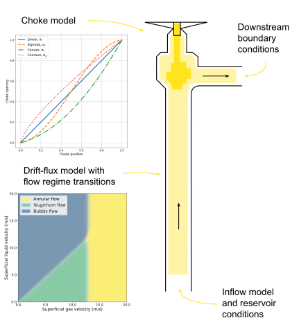

[]()

# ManyWells: simulation of multiphase flow in vertical oil and gas wells

This code implements a steady-state drift-flux model for simulating multiphase (liquid and gas) flow in wells.
Three-phase flow (gas, oil, water) is supported by treating the oil and water as one mixed liquid phase.
Wells are modelled from the bottomhole pressure to the downstream choke pressure. 
Boundary conditions are introduced via an inflow model (bottomhole) and a choke model (topside).

The simulator has several use cases:
- Generate semi-realistic well production data
- Flow prediction by calibrating the model parameters to historical data
- Investigate sensitivities of variables of interest

The figure below illustrates a well and some model components of the ManyWells simulator.


## Project overview
The project is structured as follows
```
Project folder
|-- data
|   |-- manywells_sol       # Files related to the manywells-sol dataset  
|   |-- manywells_nsol      # Files related to the manywells-nsol dataset
|   |-- manywells_nscl      # Files related to the manywells-nscl dataset
|-- docs                    # Documentation
|-- manywells               # Implementation of simulator
|   |-- calibration         # Code for calibration to data
|   |-- closed_loop         # Simulation with closed-loop control
|-- scripts                 # Various scripts and examples
|   |-- data_generation     # Scripts used to generate the ManyWells datasets
|   |-- flow_regimes        # Scripts to develop a flow regime classifier
|   |-- ml_examples         # Machine learning examples in the ManyWells paper
```

## Getting started

To start developing with ManyWells, you first need to clone the repository by running the following command:
```
GIT_LFS_SKIP_SMUDGE=1 git clone git@github.com:solution-seeker-as/manywells.git
```
The environment variable `GIT_LFS_SKIP_SMUDGE=1` is set to avoid downloading the large dataset files in the `data` folder (due to GitHub LFS quotas).

If you wish to download the datasets, you can also find them at the [ManyWells project on HuggingFace](https://huggingface.co/datasets/solution-seeker-as/manywells).

### Python environment
The `manywells` Python environment is defined by `pyproject.toml`, with specific package versions in `uv.lock`. 
Using the [uv package manager](https://docs.astral.sh/uv/), the environment is installed by running the 
following command from the project root folder: 
```console
uv sync
``` 

### Installation
If you do not plan on modifying the ManyWells files, you can optionally install ManyWells as a Python package. 
See [further instructions here](docs/installation.md). 
Note that you will only get access to the files in the `manywells` folder if you install the package. 

### Reference
If you use ManyWells in an academic work, we kindly ask you to cite our paper. 
You can cite it as shown in the bibtex entry below. 
Note that the paper is currently in review and that the below reference is to a preprint.
```
@article{Grimstad2025,
	title = {{ManyWells: Simulation of Multiphase Flow in Thousands of Wells}},
	author = {Grimstad, Bjarne and Lundby, Erlend and Andersson, Henrik},
	journal = {SSRN Electronic Journal},
	issn = {1556-5068},
	doi = {10.2139/ssrn.5256125},
	year = {2025},
	pages = {1--47},
	note = {Preprint},
}
```

### License
Manywells © 2024 by [Solution Seeker AS](https://solutionseeker.no) is licensed under 
[Creative Commons Attribution-NonCommercial 4.0 International](https://creativecommons.org/licenses/by-nc/4.0/?ref=chooser-v1). 
The license applies to all the resources contained in this project, including the code and datasets. 
The license can be found in the `LICENSE` file.
