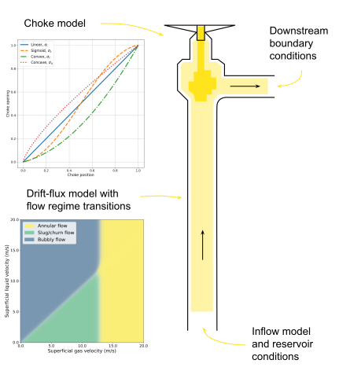

[]()

# ManyWells: simulation of multiphase flow in oil and gas wells

This code implements a steady-state drift-flux model for simulating multiphase (liquid and gas) flow in wells.
Three-phase flow (gas, oil, water) is supported by treating the oil and water as one mixed liquid phase.
Wells are modelled from the bottomhole pressure to the downstream choke pressure.
Boundary conditions are introduced via an inflow model (bottomhole) and a choke model (topside).
The steady-state equations can have more than one solution at an operating point; the simulator finds them and
labels each one stable or unstable.

The simulator has several use cases:
- Generate semi-realistic well production data
- Flow prediction by calibrating the model parameters to historical data
- Investigate sensitivities of variables of interest

The figure below illustrates a well and some model components of the ManyWells simulator.


## Versions

[ManyWells v1.0.0](https://github.com/solution-seeker-as/manywells/releases/tag/v1.0.0) is the version described in
the paper and used to generate the published datasets. The code has changed since then. It now has:

- deviated and L-shaped wells
- black-oil fluid properties with gas dissolved in the oil, and a real-gas model
- friction from the pipe's roughness
- frictional heating, a gravity term and the lift gas's temperature in the energy balance
- a fixed-rate inflow model
- a root search that returns every solution with a stability label
- a Rust core that solves the same model faster

The API differs from v1.0.0's. The `v1.0.0` configuration (`manywells.configurations.v1_well`) reproduces v1.0.0's
model, and a verifier (`verification/`) checks the simulator in that configuration against reference solutions
computed with v1.0.0.
To run the code as it was for the paper, use the `v1.0.0` tag. The closed-loop simulator, which generated
`manywells-nscl-1`, is only in v1.0.0.

## Getting started

### Installation
Clone the repository:
```console
git clone https://github.com/solution-seeker-as/manywells.git
```

The Python environment is defined by `pyproject.toml`, with specific package versions in `uv.lock`.
Using the [uv package manager](https://docs.astral.sh/uv/), install it from the project root folder:
```console
uv sync
```
The package includes a Rust core (`rust/`), which `uv sync` compiles, so building from source needs a Rust toolchain
(stable, at least 1.85, installed with [rustup](https://rustup.rs)).

If you do not plan on modifying ManyWells, you can install it as a Python package instead. This also needs the Rust
toolchain:
```console
pip install git+https://github.com/solution-seeker-as/manywells.git
```
This installs the `manywells` package only, not the scripts and examples. For v1.0.0, which needs Python 3.11,
install `git+https://github.com/solution-seeker-as/manywells.git@v1.0.0`.

### Simulating a well

```python
from manywells.simulator import WellProperties, BoundaryConditions, SSDFSimulator

wp = WellProperties()                            # a 2000 m vertical well with the default model
sim = SSDFSimulator(wp)                          # builds the well's system once
bc = BoundaryConditions(p_r=170, p_s=20, u=0.5)  # reservoir and separator pressures (bar), choke opening

op = sim.simulate(bc)                            # the operating point: the stable solution
print(f'Bottomhole pressure: {op.p_0:.1f} bar')
df = sim.solution_as_df(op)                      # pressure, velocities, void fraction, ... along the well
```

`SSDFSimulator(wp, backend='rust')` solves the same model with the Rust core.
[`docs/simulate.md`](docs/simulate.md) explains the inputs, the results and how to generate datasets, and
[`scripts/sim_examples/`](scripts/sim_examples/) has complete examples. Run the scripts as modules from the
project root, for example `uv run python -m scripts.sim_examples.vertical_well`.

### Datasets
The ManyWells datasets are on the [ManyWells project on HuggingFace](https://huggingface.co/datasets/solution-seeker-as/manywells).

You can use the `datasets` Python package to get started:
```python
import datasets

# Download 'manywells-sol-1'
data = datasets.load_dataset("solution-seeker-as/manywells", name='manywells-sol-1')

# Cast dataset to a Pandas DataFrame
df = data['train'].to_pandas()

# Print the data
print(df)
```

Each dataset has a config with the parameters each well was simulated with (`name='manywells-sol-1-config'`).
[`docs/datasets.md`](docs/datasets.md) describes the features, and [`docs/corrigendum.md`](docs/corrigendum.md)
lists the datasets' errata, including the samples that lie on an unstable solution.

## Documentation

- [`docs/simulate.md`](docs/simulate.md): setting up and solving a well, and generating datasets
- [`docs/datasets.md`](docs/datasets.md): the datasets' features
- [`docs/corrigendum.md`](docs/corrigendum.md): errors in the paper and errata in the published datasets
- [`docs/thermal_energy_modeling.md`](docs/thermal_energy_modeling.md): the derivation of the energy balance's terms
- [`docs/testing.md`](docs/testing.md): running the tests
- [`specs/`](specs/): the model's equations (`specs/model/`), the dataset sampling, the verifier and the
  architecture
- [`AGENTS.md`](AGENTS.md): for contributors, including coding agents: the environment, the layout and the rules
  for changing the code

## Project overview
The project is structured as follows
```
Project folder
|-- docs                    # Documentation
|-- src/manywells           # Implementation of simulator
|   |-- pvt                 # Fluid properties
|   |-- solvers             # Root search, with the CasADi and Rust backends
|   |-- sampling            # Sampling of wells and operating points for datasets
|   |-- datasets            # Dataset rows and files
|   |-- calibration         # Code for calibration to data
|-- rust                    # The Rust core, built as manywells._core
|-- specs                   # Specifications: the model, sampling, verification, architecture
|-- verification            # The verifier (package manywells-verify)
|-- plans                   # Plans of work and backlog
|-- scripts                 # Various scripts and examples
|   |-- data_generation     # Scripts that generate datasets
|   |-- flow_regimes        # Scripts to develop a flow regime classifier
|   |-- ml_examples         # Machine learning examples in the ManyWells paper
|   |-- sim_examples        # Examples showing how to simulate various wells
|   |-- verification        # Scripts that run the simulator for the verifier
|-- tests                   # Tests
```

### Reference
If you use ManyWells in an academic work, we kindly ask you to cite our paper.
You can cite it as shown in the bibtex entry below.
```
@article{Grimstad2026,
	title = {{ManyWells: Simulation of multiphase flow in thousands of wells}},
	author = {Bjarne Grimstad and Erlend Lundby and Henrik Andersson},
	journal = {Geoenergy Science and Engineering},
	volume = {257},
	pages = {214226},
	year = {2026},
	issn = {2949-8910},
	doi = {https://doi.org/10.1016/j.geoen.2025.214226},
}
```

[You can find a paper corrigendum here](docs/corrigendum.md).

[ManyWells version 1.0.0](https://github.com/solution-seeker-as/manywells/releases/tag/v1.0.0) was used to generate the data in the paper.

### License
Manywells © 2024 by [Solution Seeker AS](https://solutionseeker.no) is licensed under
[Creative Commons Attribution-NonCommercial 4.0 International](https://creativecommons.org/licenses/by-nc/4.0/?ref=chooser-v1).
The license applies to all the resources contained in this project, including the code and datasets.
The license can be found in the `LICENSE` file.
