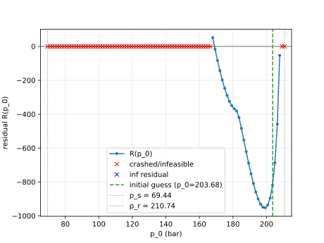
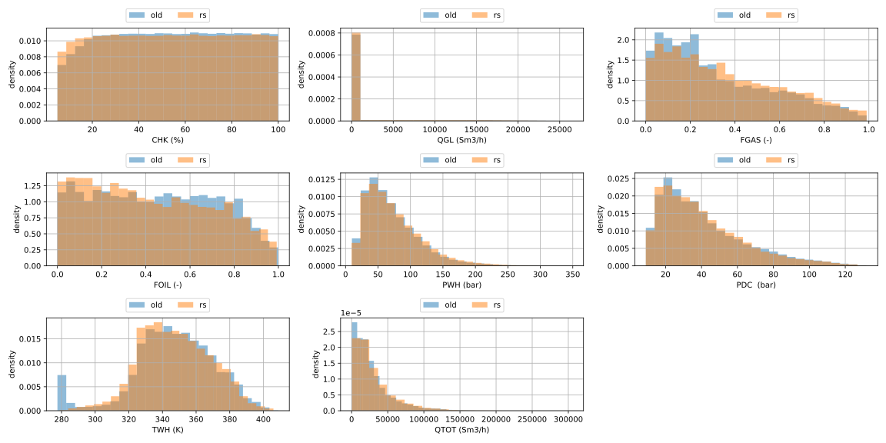
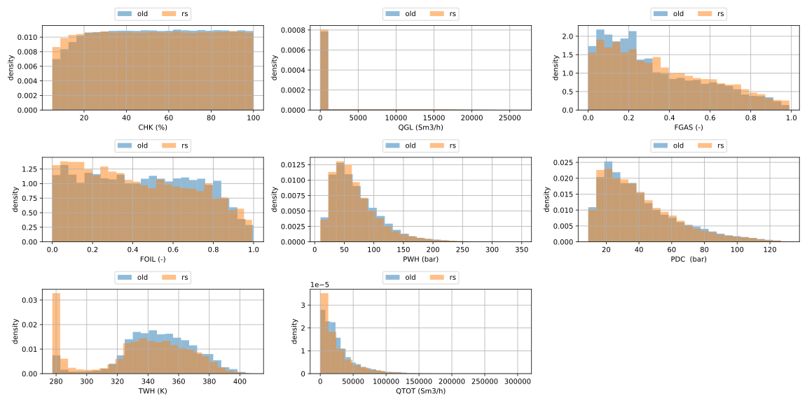
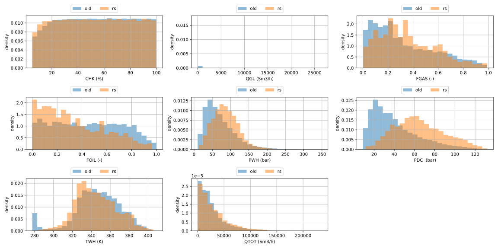
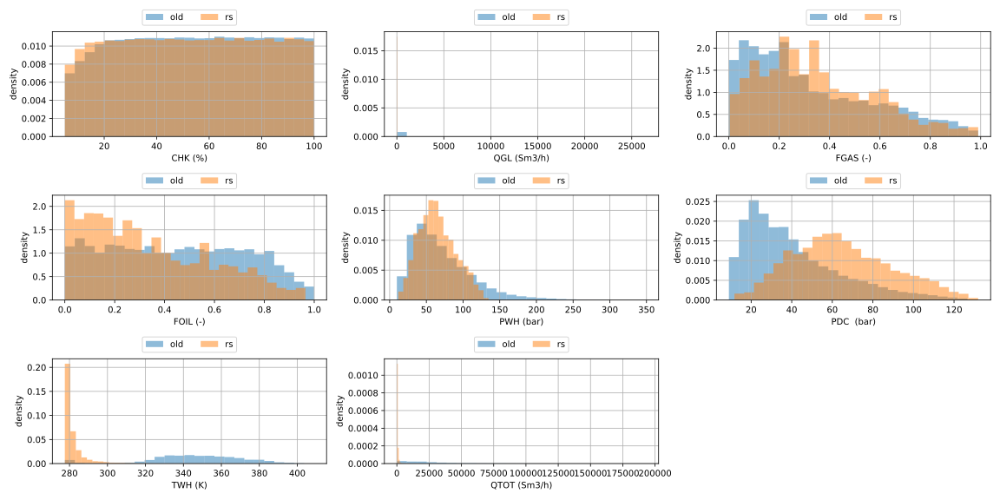
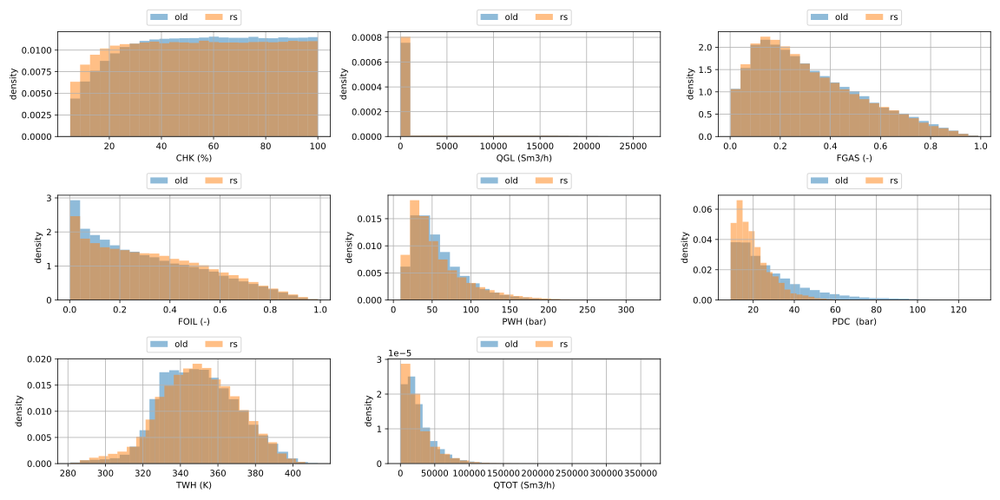
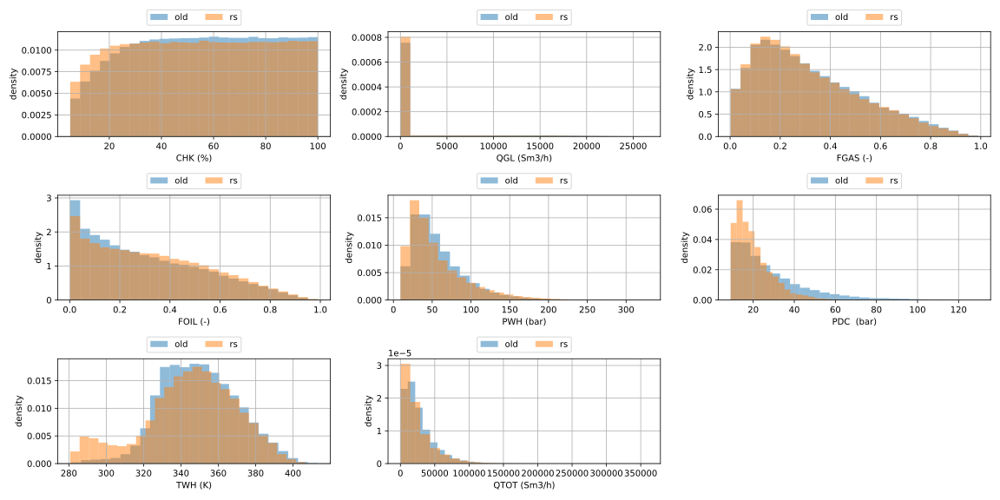
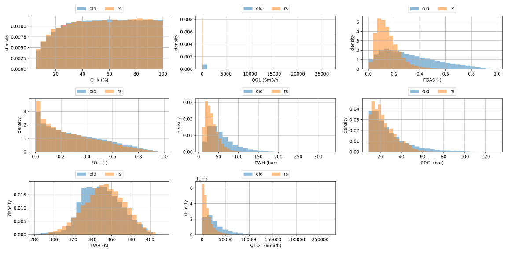
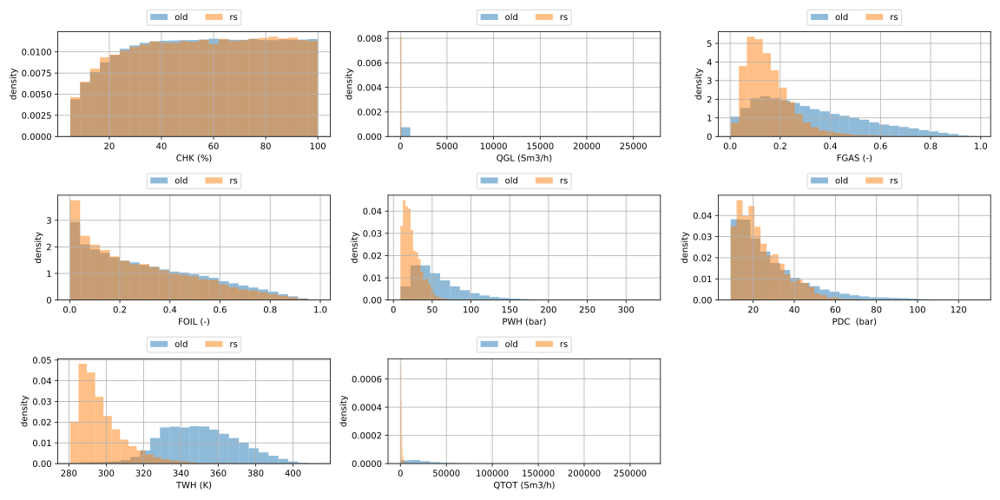

This file documents changes and additions I made for the rust simulator in additions to benchmarking, convergence tests and general thoughts.
In addition to this file, it might be useful to look through the notebook `notebook.ipynb`.

The manywells dataset was downloaded and saved locally under `data/`. The script `scripts/save_datasets_local.py` was used to download and store the data.

# Tutorial on how to simulate a well (with rust solver)

1. Read `simulate.md`.
2. Install the rust simulator (see [Installing the rust simulator](#installing-the-rust-simulator) below).
3. Swap the import: use `from manywells_rs import SSDFSimulator` instead of `from manywells.simulator import SSDFSimulator`. The rust `SSDFSimulator` accepts the ordinary `manywells` `WellProperties`/`BoundaryConditions` (and their inflow/choke models) directly. The one API difference is that `simulate()` returns a *list* of solutions (a well can have multiple steady operating points).

```python
# from manywells.simulator import SSDFSimulator
from manywells_rs import SSDFSimulator

sim = SSDFSimulator(well.wp, well.bc)   # plain manywells objects, no conversion
solutions = sim.simulate()             # list of solutions (>= 1), highest p0 first
df = sim.solution_as_df(solutions[0])  # highest-p0 operating point
```

# Installing the rust simulator

`manywells_rs` is a mixed Rust/Python package built with [maturin](https://www.maturin.rs/). Building it requires a Rust toolchain (`cargo`, e.g. via [rustup](https://rustup.rs/)) and the CPython development headers (`python3-dev` on Debian/Ubuntu).

From the repository root, with the project virtual environment active:

```bash
# One-time: install the build tool into the venv
uv pip install maturin

# Build the Rust extension and install manywells_rs into the active venv.
# `develop` gives an editable install: Python-side changes (the thin wrapper) are
# picked up without rebuilding, but re-run this after editing the Rust sources.
# Drop --release for faster, unoptimised debug builds.
cd manywells_rs
maturin develop --release
```

Verify the install:

```bash
python -c "from manywells_rs import SSDFSimulator; print(SSDFSimulator)"
```

# What has changed

1. The solver `manywells/simulator.py` offloads the system of non linear equations to
a NLP solver (CasADi with IPOPT). The rust solver does not setup a NLP, but solves the differential algebraic equation(s) using implicit Euler (with fixed point iterations for alpha) inside a single shooting loop for the bottomhole pressure instead. 
  - inspired by (manywells-masters)[https://github.com/oystebw/manywells-masters], but with a few changes:
    1. implicit Euler step the the momentum differential equation.
    2. analytic solution for temperature over the entire well
    3. root finding instead of predictor-corrector for the pressure in the next cell.
    4. fixed point iterations for alpha until convergence instead of 4 iterations.
2. cl_simulator adds a non zero objective function to the NLP. manywells_rs does not invoke a NLP solver, so this is not supported.

# A note on multiple solutions (and simulator failures)

My rust solver uses a shooting method. The inflow model gives an equation that depends on the bottomhole pressure $p(z = 0)$.
Given a value $p_0 = p(z = 0)$, the solver integrates to the top of the well and computes the residual against the boundary condition at $z = L$.
Intuitivly: How far away is the predicted pressure at the well head from satisfying the choke model at the top of the well?
The first implementation of the integrator failed quite often due to "non physical" behaviour (or at least behaviour that the model does not satisfy the assumptions of the model). I observed the following:

1. pressure $p$ dropped below 0.
2. solving for alpha via the slip relation failed.
3. $p_u - p_s$ was negative, resulting in $\sqrt{2p_e(p_u-p_s)}$ failing in the Choke model.

Plotting $R(p0)$ over the domain $p0 \in (p_s, p_r)$ for `WELL_ID = 977` from `manywells-sol/manywells-sol-1_config`:



I tried to remedy this by "continuation" of the residual function.

1. If $p$ drop below $0$, mark the current integration as `failed` and propagate the current cell solution to the top 
2. If the root finder for $alpha$ fails, clamp it either to `1e-6` or `1 - 1e-6`, mark the current integration as `failed` and propagate the current cell solution to the top.
3. squaring the Choke model based on Bernoulli to ensure that we do not take square root of negative number.

This results in smoother `R(p0)`, making it easier for the shooting method to find a plausible solution.


NOTE: we need to make sure that this continuation does not lead to "false" solutions.
I handle this by only returning roots that has `failed = False` .

## example of multiple solutions:

`WELL_ID = 977` from `manywells-sol/manywells-sol-1_config`.

The old simulator finds this solutions:
```
               z           p       v_g       v_l     alpha       rho_g  \
0       0.000000  208.021807  0.429210  0.097178  0.293167  142.797996   
1      21.132954  206.487675  0.430413  0.097358  0.294469  141.769316   
2      42.265907  204.956395  0.431615  0.097534  0.295745  140.764535   
3      63.398861  203.427919  0.432816  0.097708  0.296999  139.781360   
4      84.531814  201.902206  0.434017  0.097880  0.298232  138.817718   
..           ...         ...       ...       ...       ...         ...   
96   2028.763537   74.266534  0.665380  0.121514  0.434723   62.119016   
97   2049.896490   73.053951  0.671485  0.121960  0.436792   61.262707   
98   2071.029444   71.846115  0.677775  0.122413  0.438876   60.405955   
99   2092.162397   70.643065  0.684256  0.122873  0.440977   59.548787   
100  2113.295351   69.444838  0.690936  0.123340  0.443094   58.691233   

          rho_l           T flow-regime  
0    989.499088  351.548861      bubbly  
1    989.499088  351.488266      bubbly  
2    989.499088  351.372013      bubbly  
3    989.499088  351.204634      bubbly  
4    989.499088  350.990293      bubbly  
..          ...         ...         ...  
96   989.499088  288.514422      bubbly  
97   989.499088  287.770629      bubbly  
98   989.499088  287.026821      bubbly  
99   989.499088  286.282998      bubbly  
100  989.499088  285.539162      bubbly  
```

whilst the rust simulator finds these two solution:

```
               z           p       v_g       v_l     alpha       rho_g  \
0       0.000000  208.022441  0.429155  0.097152  0.293135  142.798431   
1      21.132954  206.488292  0.430367  0.097333  0.294455  141.758223   
2      42.265907  204.957027  0.431576  0.097512  0.295746  140.743999   
3      63.398861  203.428593  0.432783  0.097687  0.297012  139.753181   
4      84.531814  201.902943  0.433990  0.097860  0.298256  138.783443   
..           ...         ...       ...       ...       ...         ...   
96   2028.763537   74.266742  0.665265  0.121479  0.434694   62.119453   
97   2049.896490   73.054105  0.671368  0.121926  0.436763   61.263108   
98   2071.029444   71.846217  0.677656  0.122379  0.438848   60.406319   
99   2092.162397   70.643114  0.684136  0.122838  0.440949   59.549114   
100  2113.295351   69.444835  0.690815  0.123306  0.443066   58.691521   

          rho_l           T flow-regime  
0    989.499088  351.548861      bubbly  
1    989.499088  351.516824      bubbly  
2    989.499088  351.424365      bubbly  
3    989.499088  351.276612      bubbly  
4    989.499088  351.078257      bubbly  
..          ...         ...         ...  
96   989.499088  288.513200      bubbly  
97   989.499088  287.769355      bubbly  
98   989.499088  287.025497      bubbly  
99   989.499088  286.281628      bubbly  
100  989.499088  285.537749      bubbly  

               z           p       v_g       v_l     alpha       rho_g  \
0       0.000000  168.986229  4.013033  2.120184  0.543670  116.001756   
1      21.132954  167.777605  4.031058  2.127009  0.545134  115.172853   
2      42.265907  166.571614  4.049242  2.133906  0.546604  114.347260   
3      63.398861  165.368256  4.067586  2.140877  0.548081  113.524937   
4      84.531814  164.167535  4.086092  2.147925  0.549564  112.705842   
..           ...         ...       ...       ...       ...         ...   
96   2028.763537   73.917781  5.803908  5.253332  0.815831   53.450548   
97   2049.896490   73.243796  5.839871  5.299558  0.817437   53.016993   
98   2071.029444   72.572492  5.876458  5.345992  0.819023   52.584900   
99   2092.162397   71.903802  5.913678  5.392660  0.820589   52.154213   
100  2113.295351   71.237665  5.951533  5.439604  0.822137   51.724879   

          rho_l           T flow-regime  
0    989.499088  351.548861  slug-churn  
1    989.499088  351.546524  slug-churn  
2    989.499088  351.539533  slug-churn  
3    989.499088  351.527917  slug-churn  
4    989.499088  351.511706  slug-churn  
..          ...         ...         ...  
96   989.499088  333.730347     annular  
97   989.499088  333.391632     annular  
98   989.499088  333.050374     annular  
99   989.499088  332.706589     annular  
100  989.499088  332.360293     annular  
```

If I set the initial guess for p0 to be closer to the other solution, CasADi returns the same solution as the rust simulator.

Questions: 
Can this explain the different behaviour in CHK and TWH noted above?
Is there any physical reason for why we find multiple solutions?

## The root finder

By inspecting plots of residuals, they all seem to dip below 0 for `p0` pretty close to `p_r` and then rise
again in a 'U' shape. I assume that the residual function have this shape for the outer shooting loop.

## Simulator failures

For some well configurations, a simulator failure is "correct". There is no bottomhole pressure that satisfies the choke model at the well head.
Take a look at this residual plot:


Both the rust simulator and the old one fails in this case.

# Data generation

I duplicated `data_generation/open_loop_stationary/generate_well_data.py` used the new rust simulator instead.
Since it outputs a list of solutions, the resulting dataset contains additional features: sample_id and solution_number.
Below are comparisons of histograms of variables.

## sol: Keep only the solutions with the lowest PBH value (includes cases where only 1 solution was found)



## sol: Keep only the solutions with the highest PBH value (includes cases where only 1 solution was found)



## sol: Keep only the solutions with the lowest PBH value if 2 solutions were found



## sol: Keep only the solutions with the highest PBH value if 2 solutions were found




## Observations:

1. The old simulator spike around 280K in the TWH distribution. I can reproduce this spike
by only keeping the solutions with the highest PBH value in the cases where the rust simulator found 2 solutions. This spike disappears if we only keep the lowest PBH solutions.

---

I then generated data using the open loop non stationary script instead.

## nsol: Keep only the solutions with the lowest PBH value (includes cases where only 1 solution was found)



## nsol: Keep only the solutions with the highest PBH value (includes cases where only 1 solution was found)



## nsol: Keep only the solutions with the lowest PBH value if 2 solutions were found



## nsol: Keep only the solutions with the highest PBH value if 2 solutions were found




# Convergence analysis

`scripts/compare_simulators.py` contains a function `run_convergence`.
Since the new simulator may return multiple solutions,
it uses the solution with PBH closest to the old simulator.
 The notebook contains an example run.

# Benchmarking

`scripts/compare_simulators.py` may be ran with the `benchmark` command.

Results from running it on my Lenovo Yoga Slim 7 14IMH9 with an Intel(R) Core(TM) Ultra 7 155H cpu:

```
/home/oskar/manywells/data/manywells-nscl/manywells-nscl-1_config.zip
  simulator     wells  success   fail   total(s)   mean(s)  median(s)    max(s)
  rust           2000     1970     30     17.863    0.0089     0.0081    0.0916
  simulator      2000     1304    696   1556.988    0.7785     0.8123    9.0208

/home/oskar/manywells/data/manywells-nsol/manywells-nsol-1_config.zip
  simulator     wells  success   fail   total(s)   mean(s)  median(s)    max(s)
  rust           2000     1980     20     16.760    0.0084     0.0079    0.0815
  simulator      2000     1363    637   1613.571    0.8068     0.8310    2.9358

/home/oskar/manywells/data/manywells-sol/manywells-sol-1_config.zip
  simulator     wells  success   fail   total(s)   mean(s)  median(s)    max(s)
  rust           2000     2000      0     10.620    0.0053     0.0052    0.0204
  simulator      2000     1997      3   1799.073    0.8995     0.8630    2.4404

Overall
  simulator     wells  success   fail   total(s)  mean/well(s)  speedup
  rust           6000     5950     50     45.242        0.0075   109.8x
  simulator      6000     4664   1336   4969.632        0.8283     1.0x
```

# Tests

I copied over the relevant tests from the `develop` branch into the rust version.
Run `cargo test` to run the tests. You might need to install `python3-dev` to make this work.
Also, since the rust project is it's own "thing", having the main `manywells` environment activated may cause issues.

# How does it compare to the develop branch

I intentionally tailored the new solver to solve the original DAE (differential algebraic equations) from the paper.
It might or might not be easy to incorporate additions and modifications of the model into the solver due to:

1. it is not formulated as an NLP
2. the temperature profile is integrated analytically over the entire well given the initial condition $T(z=0) = T_r$.
3. numerical integration is done by solving two equations with a root finding method:
  - the slip relation for $\alpha$
  - and then the discretized momentum equation for $p$.

# Further work / ideas

Just writing down some thoughts:

2. https://www.sintef.no/globalassets/project/co2-dynamics/publications/lund_two-phase_relaxation_hierarchy.pdf

3. Newton-Krylov + implicit time integration?
  - https://www.sciencedirect.com/science/article/abs/pii/S0306454917303766

4. Instead of using NLP solver, maybe using some numerical non linear solver like JFNK directly?

5. How much work is needed to add time dependence to the equations? The energy balance is the tricky one I think.

## Using the rust simulator as a "black box" for optimization problems

Even though the rust simulator does use a NLP solver as the old one, we can still
solve some optimization problems using it. See `scripts/opt_with_rust_simulator.py`
for a demo of how the non stationary closed loop simulation can be replicated (with a speedup of ~8x!)
with the rust simulator.

Note: Since the rust simulator returns multiple solutions when found, one has to choose a "solution picker" strategy.


Here is some results I gather when running `uv run python scripts/compare_opt_rust_vs_cl.py --max-wells 50`:

```
Both succeeded: 34/50
  |du|    mean=0.1401  median=0.0000  max=0.9862
  |dw_lg| mean=0.0008  median=0.0000  max=0.0102
  time    old mean=3.66s  rust mean=0.45s
  dt      mean=+3.21s  median=+2.72s
  speedup mean=8.7x  median=8.3x

 well_id  has_gas_lift     w_ref  old_ok  rust_ok    u_old   u_rust     w_lg_old    w_lg_rust        du         dw_lg        f_old     t_old   t_rust        dt   speedup
       0          True 26.220290    True     True 1.000000 1.000000 2.234085e+00 2.236530e+00  0.000000  2.444698e-03 6.323885e+01  3.369487 0.437034  2.932453  7.709900
       1         False 16.150052    True     True 1.000000 0.999995 3.437523e-09 0.000000e+00 -0.000005 -3.437523e-09 1.328466e+01  3.693211 0.686086  3.007124  5.383011
       2         False  5.825804    True     True 0.501994 0.999993 0.000000e+00 0.000000e+00  0.498000  0.000000e+00 1.366157e+01  5.984966 0.983578  5.001388  6.084891
       3         False 10.245652    True     True 1.000000 0.999997 9.835757e-09 0.000000e+00 -0.000003 -9.835757e-09 3.288242e+01  4.421474 0.359463  4.062011 12.300229
       4         False 19.058517    True     True 0.266241 0.267255 0.000000e+00 0.000000e+00  0.001014  0.000000e+00 1.599842e-12  2.734984 0.296774  2.438210  9.215706
       5         False 19.482175    True     True 0.038779 0.999996 0.000000e+00 0.000000e+00  0.961217  0.000000e+00 2.687427e+02  2.953185 0.548485  2.404700  5.384260
       6         False 21.284155    True     True 0.389577 0.390632 0.000000e+00 0.000000e+00  0.001055  0.000000e+00 3.973775e-14  3.295389 0.368926  2.926462  8.932378
       7          True 19.474775    True     True 1.000000 1.000000 9.413214e-01 9.311521e-01  0.000000 -1.016923e-02 4.234035e+00  3.284811 0.544458  2.740353  6.033172
       8          True 12.369272    True     True 1.000000 1.000000 3.129254e-01 3.138736e-01  0.000000  9.481695e-04 9.835354e-02  2.721271 0.274009  2.447263  9.931334
       9         False  8.419543    True     True 1.000000 0.999994 8.025219e-09 0.000000e+00 -0.000006 -8.025219e-09 3.488506e-01  2.647077 0.482401  2.164676  5.487291
      10         False  7.269874   False     True      NaN 0.449735          NaN 0.000000e+00       NaN           NaN          NaN  2.132468 0.146222       NaN       NaN
      11         False  6.906335   False     True      NaN 0.999995          NaN 0.000000e+00       NaN           NaN          NaN  0.366304 0.634492       NaN       NaN
      12          True 14.392070    True     True 1.000000 1.000000 1.429485e+00 1.434147e+00  0.000000  4.661652e-03 2.289279e+00  4.186644 0.300788  3.885856 13.918917
      13         False 15.280231    True     True 1.000000 0.999994 9.938042e-09 0.000000e+00 -0.000006 -9.938042e-09 5.460220e+01  1.541584 0.197821  1.343763  7.792828
      14          True 14.107949    True     True 1.000000 1.000000 4.708828e-01 4.721957e-01  0.000000  1.312843e-03 3.241074e-01  1.974810 0.207610  1.767200  9.512106
      15         False 42.258315    True     True 0.050500 0.999995 0.000000e+00 0.000000e+00  0.949495  0.000000e+00 1.057598e+03  6.365950 0.708826  5.657124  8.980974
      16          True 33.232187    True     True 1.000000 1.000000 5.000000e+00 4.999843e+00  0.000000 -1.574806e-04 1.427503e+02  3.962649 0.561629  3.401020  7.055635
      17         False 15.535143   False     True      NaN 0.999995          NaN 0.000000e+00       NaN           NaN          NaN  5.354163 0.455217       NaN       NaN
      18         False 22.651906    True     True 0.819549 0.833382 0.000000e+00 0.000000e+00  0.013833  0.000000e+00 1.074702e-17  3.328853 0.249328  3.079525 13.351302
      19         False 11.630916    True     True 0.999999 0.999996 0.000000e+00 0.000000e+00 -0.000003  0.000000e+00 7.596863e-04  2.895704 0.495403  2.400301  5.845145
      20         False 10.033644    True     True 1.000000 0.999994 9.695853e-09 0.000000e+00 -0.000006 -9.695853e-09 3.407765e+00  2.408663 0.495718  1.912945  4.858939
      21         False 13.512056    True     True 0.889890 0.904017 0.000000e+00 0.000000e+00  0.014126  0.000000e+00 5.647981e-18  3.071186 0.379998  2.691188  8.082119
      22         False 17.859119   False     True      NaN 0.999995          NaN 0.000000e+00       NaN           NaN          NaN  0.789588 0.596910       NaN       NaN
      23         False 26.120705    True     True 1.000000 0.999993 5.093244e-09 0.000000e+00 -0.000007 -5.093244e-09 6.681006e+01 16.206561 0.804652 15.401908 20.141071
      24         False 13.977946    True     True 0.140218 0.745397 0.000000e+00 0.000000e+00  0.605179  0.000000e+00 7.550893e+01  1.455797 0.168954  1.286844  8.616540
      25         False  7.318243   False     True      NaN 0.999995          NaN 0.000000e+00       NaN           NaN          NaN  2.762531 0.558185       NaN       NaN
      26         False  6.517138   False     True      NaN 0.770744          NaN 0.000000e+00       NaN           NaN          NaN  1.801125 0.266198       NaN       NaN
      27         False 19.866965    True     True 1.000000 0.999996 9.983359e-09 0.000000e+00 -0.000004 -9.983359e-09 8.121044e+01  2.804125 0.339488  2.464637  8.259858
      28         False 25.942917   False     True      NaN 0.999995          NaN 0.000000e+00       NaN           NaN          NaN  3.209047 0.294700       NaN       NaN
      29         False 21.442365    True     True 0.272518 0.999994 0.000000e+00 0.000000e+00  0.727476  0.000000e+00 1.958753e+02  1.622177 0.317507  1.304670  5.109113
      30         False  9.194435   False     True      NaN 0.348029          NaN 0.000000e+00       NaN           NaN          NaN  6.572411 0.232711       NaN       NaN
      31         False 15.979998   False     True      NaN 0.999996          NaN 0.000000e+00       NaN           NaN          NaN  1.396510 0.742058       NaN       NaN
      32         False 32.239616   False     True      NaN 0.999994          NaN 0.000000e+00       NaN           NaN          NaN  4.288107 0.418706       NaN       NaN
      33         False 27.090416    True     True 1.000000 0.999995 8.144432e-09 0.000000e+00 -0.000005 -8.144432e-09 1.445121e+01  2.321975 0.388962  1.933013  5.969677
      34         False 22.215414   False     True      NaN 0.999996          NaN 0.000000e+00       NaN           NaN          NaN  2.523714 0.321031       NaN       NaN
      35         False  7.502757    True     True 0.127228 0.127949 0.000000e+00 0.000000e+00  0.000722  0.000000e+00 4.462847e-13  2.647963 0.313745  2.334218  8.439869
      36         False 21.413523   False     True      NaN 0.999994          NaN 0.000000e+00       NaN           NaN          NaN  7.053276 0.364657       NaN       NaN
      37         False 19.469984    True     True 1.000000 0.999995 8.113642e-09 0.000000e+00 -0.000005 -8.113642e-09 1.013979e+01  3.730241 0.446123  3.284118  8.361464
      38         False 10.167435    True     True 0.454226 0.456515 0.000000e+00 0.000000e+00  0.002288  0.000000e+00 1.289535e-15  3.111650 0.291224  2.820427 10.684741
      39         False 23.840762    True     True 1.000000 0.999995 9.679420e-09 0.000000e+00 -0.000005 -9.679420e-09 4.281144e+01  4.044890 0.730856  3.314033  5.534452
      40         False 26.484843    True     True 0.405605 0.407867 0.000000e+00 0.000000e+00  0.002262  0.000000e+00 2.213667e-17  3.680386 0.329107  3.351278 11.182937
      41         False 16.145084    True     True 0.635597 0.636335 0.000000e+00 0.000000e+00  0.000738  0.000000e+00 7.449494e-15  2.244384 0.120683  2.123701 18.597376
      42         False 30.129636    True     True 0.013752 0.999993 0.000000e+00 0.000000e+00  0.986241  0.000000e+00 6.453760e+02  7.061609 0.641245  6.420364 11.012341
      43         False 15.194750    True     True 0.323508 0.324221 0.000000e+00 0.000000e+00  0.000713  0.000000e+00 4.137792e-14  3.157959 0.337117  2.820842  9.367544
      44          True 13.320732   False     True      NaN 1.000000          NaN 1.268496e-07       NaN           NaN          NaN  0.500394 0.363694       NaN       NaN
      45         False 26.047238   False     True      NaN 0.755729          NaN 0.000000e+00       NaN           NaN          NaN  8.926677 0.465997       NaN       NaN
      46          True 38.001566    True     True 1.000000 1.000000 3.877634e+00 3.875456e+00  0.000000 -2.178295e-03 4.545403e+01  3.668618 1.146274  2.522344  3.200472
      47          True 25.571090   False     True      NaN 1.000000          NaN 4.999745e+00       NaN           NaN          NaN  1.381446 0.479892       NaN       NaN
      48          True 10.288676    True     True 1.000000 1.000000 1.572917e+00 1.577608e+00  0.000000  4.691496e-03 6.291088e+00  1.992872 0.371017  1.621855  5.371380
      49         False 11.139419   False     True      NaN 0.918828          NaN 0.000000e+00       NaN           NaN          NaN  2.046802 0.386227       NaN       NaN
```

### Observations:

1. rust simulator did not fail on any of the 50 first well ids
2. rust simulator is faster
3. sometimes the solution found is very different: maximum difference of choke is $|\Delta u| = 0.9862$.
I suspect this is because the rust simulator chose a different "path" when it "picks solutions" than the old one.